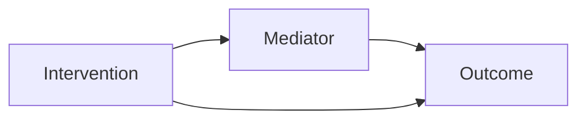
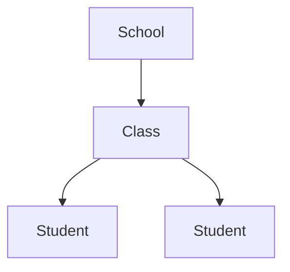

# Education Advanced Quantitative Modeling

## Goal

Select, specify, run, and report advanced quantitative models that match education research questions and data structures.

## Use After

Use after:

- `education-quantitative-data-cleaning`
- `education-descriptive-statistics`
- `education-inferential-statistics`
- `education-validity-reliability-analysis`
- `education-quantitative-study-design`
- `education-learning-analytics-design`
- `education-program-evaluation`

Do not expose the skill name to users. Present it as "高级量化模型分析".

## Inputs

- Research questions/hypotheses
- Cleaned dataset
- Variable roles and levels
- Sample size and clustering structure
- Timepoints if longitudinal/pre-post/panel
- Measurement model if latent variables are used
- Intervention/control group design if applicable

## Model Selection Guide

| Research Need | Data Structure | Recommended Model |
|---|---|---|
| Students nested in classes/schools | Student + class/school IDs | Multilevel model / HLM |
| Latent constructs measured by items | Item-level scale data | CFA / SEM |
| Test indirect mechanism | IV -> mediator -> DV | Mediation model |
| Test different effect by subgroup | Predictor x moderator | Moderation model |
| Latent constructs + paths | Latent variables with relationships | SEM |
| Item difficulty/discrimination | Test/item response data | IRT/Rasch |
| Growth over time | 3+ timepoints | Growth curve / longitudinal mixed model |
| Policy/intervention before-after with comparison group | Treatment/control + pre/post | DID |
| Nonrandomized comparison | Observational treatment/control | Propensity score matching/weighting + regression |
| Repeated measures within students/classes | Repeated observations | Mixed-effects model |

## Workflow

1. Confirm whether an advanced model is justified.
2. Identify unit and level:
   - item
   - timepoint
   - student
   - class
   - teacher
   - school
   - region
3. Check sample size/model complexity.
4. Select model family.
5. Specify variables and equations/path diagram.
6. Check assumptions and diagnostics.
7. Run baseline/simple model first.
8. Add complexity stepwise.
9. Interpret parameters with educational meaning.
10. Produce tables, diagrams, and reporting text.

## Tool Calls

### R Packages

```r
install.packages(c(
  "tidyverse", "lme4", "lmerTest", "performance", "broom.mixed",
  "lavaan", "semTools", "mediation", "interactions", "mirt",
  "TAM", "MatchIt", "WeightIt", "fixest", "did", "marginaleffects"
))
```

Multilevel model:

```r
library(lme4)
library(lmerTest)
fit <- lmer(score_post ~ group + score_pre + (1 | class_id), data = data)
summary(fit)
performance::check_model(fit)
```

Random slope model:

```r
fit <- lmer(score_post ~ group + score_pre + (1 + group | class_id), data = data)
```

SEM:

```r
library(lavaan)
model <- '
  motivation =~ m1 + m2 + m3 + m4
  engagement =~ e1 + e2 + e3 + e4
  achievement ~ motivation + engagement
  engagement ~ motivation
'
fit <- sem(model, data = data, estimator = "MLR", missing = "fiml")
summary(fit, fit.measures = TRUE, standardized = TRUE)
```

Mediation:

```r
model <- '
  mediator ~ a * intervention
  outcome ~ b * mediator + cprime * intervention
  indirect := a * b
  total := cprime + (a * b)
'
fit <- sem(model, data = data, se = "bootstrap", bootstrap = 5000)
summary(fit, standardized = TRUE, ci = TRUE)
```

IRT:

```r
library(mirt)
fit <- mirt(item_data, 1, itemtype = "2PL")
summary(fit)
coef(fit, IRTpars = TRUE)
```

DID:

```r
library(fixest)
fit <- feols(outcome ~ treatment * post + covariates | school_id + time, data = data)
summary(fit)
```

Propensity score matching:

```r
library(MatchIt)
m <- matchit(treatment ~ pre_score + gender + grade + ses, data = data, method = "nearest")
matched <- match.data(m)
```

### Python Packages

```bash
pip install pandas numpy statsmodels linearmodels semopy pyirt scikit-learn causalinference
```

Mixed model:

```python
import statsmodels.formula.api as smf
fit = smf.mixedlm("score_post ~ group + score_pre", data=df, groups=df["class_id"]).fit()
print(fit.summary())
```

DID:

```python
import statsmodels.formula.api as smf
fit = smf.ols("outcome ~ treatment * post + covariates", data=df).fit(cov_type="cluster", cov_kwds={"groups": df["school_id"]})
print(fit.summary())
```

### Specialized Tools

```text
Mplus: https://www.statmodel.com/
HLM: https://ssicentral.com/index.php/products/hlm-general/
Stata: https://www.stata.com/
AMOS: https://www.ibm.com/products/structural-equation-modeling-sem
Winsteps: https://www.winsteps.com/
jamovi SEMLj module: https://semlj.github.io/
```

## Output Format

### 1. Model Choice Table

| RQ/Hypothesis | Data Structure | Candidate Model | Recommended Model | Reason |
|---|---|---|---|---|

### 2. Variable-Level Table

| Variable | Role | Level | Type | Notes |
|---|---|---|---|---|

Levels:

- item
- timepoint
- student
- class
- teacher
- school
- region

### 3. Model Specification

| Component | Specification |
|---|---|
| Outcome |  |
| Fixed effects |  |
| Random effects |  |
| Latent variables |  |
| Covariates |  |
| Clustering |  |
| Estimator |  |

### 4. Model Results Table

| Parameter | Estimate | SE | Test Statistic | p | 95% CI | Interpretation |
|---|---|---|---|---|---|---|

### 5. Diagnostics / Fit

| Model Type | Diagnostics |
|---|---|
| Multilevel | ICC, random effects, residuals, convergence |
| SEM | CFI, TLI, RMSEA, SRMR, standardized loadings |
| IRT | item difficulty, discrimination, item fit |
| DID | parallel trends, clustered SEs, robustness |
| PSM | covariate balance, common support |

## Mermaid Templates

### Mediation



### Multilevel Data



## Education-Specific Guidance

- Education data are often nested; inspect ICC before ignoring class/school effects.
- SEM requires theory-driven measurement and structural models.
- DID requires credible parallel trends; do not use it just because data are pre/post.
- IRT requires item-level response data and enough examinees/items.
- Mediation with cross-sectional data should be interpreted cautiously.
- Program evaluation with nonrandom assignment may require baseline controls or propensity methods.

## Quality Rules

- Start with the simplest defensible model.
- Do not use advanced models to disguise weak design.
- Report model assumptions and diagnostics.
- Avoid causal language without causal identification.
- Keep model complexity proportional to sample size.
- For nested education data, cluster-robust SEs or multilevel models may be needed.

## User-Facing Closure

End by choosing the next modeling step:

```text
根据你的数据结构，最合适的高级模型是 [模型]，原因是 [简短原因]。接下来我可以先帮你写模型设定和变量层级表，或者直接生成 R/SPSS/Stata/Mplus 分析脚本。
```
