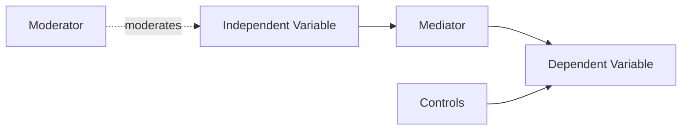

# Education Variable Identification

## Goal

Transform a topic, research question, or literature set into a defensible variable/construct model for education research.

## Inputs

- Research question or hypothesis
- Topic and population
- PDFs, abstracts, Zotero export, or paper list if available
- Intended method: survey, experiment, quasi-experiment, learning analytics, classroom observation, qualitative coding, mixed methods

## Workflow

1. Parse the research question into constructs.
2. Classify each construct:
   - independent variable
   - dependent variable
   - mediator
   - moderator
   - control variable
   - grouping variable
   - qualitative theme/phenomenon
3. Search literature for how constructs are measured.
4. Extract instruments, dimensions, sample items, and reported reliability if available.
5. Build a conceptual model.
6. Produce operational definitions and data collection suggestions.

## Tool Calls

### Zotero Export

Ask the user to export selected Zotero items as BibTeX/RIS/CSV, or use Zotero local data if available.

Zotero download:

```text
https://www.zotero.org/download/
```

Suggested Zotero workflow:

1. Create collection for the research topic.
2. Export collection as BibTeX or CSV.
3. Use abstracts/PDFs to extract variables and instruments.

### PDF Text Extraction

Use local tools if PDFs are provided:

```bash
pdftotext input.pdf output.txt
```

or:

```bash
python -m pymupdf gettext input.pdf
```

Then search the text:

```bash
rg -n "variable|measure|instrument|scale|reliability|Cronbach|mediator|moderator|control" output.txt
```

### Semantic Scholar / OpenAlex

Search for measurement studies:

```bash
curl "https://api.semanticscholar.org/graph/v1/paper/search?query=academic%20self-efficacy%20scale%20students%20education&limit=10&fields=title,year,abstract,citationCount,authors"
```

```bash
curl "https://api.openalex.org/works?search=academic%20self-efficacy%20scale%20education&per-page=10&mailto=YOUR_EMAIL"
```

### Elicit-Style Extraction Fields

When using Elicit or an LLM extraction table, use these columns:

```text
study design | sample | independent variables | dependent variables | mediators | moderators | controls | instruments | reliability | key findings | limitations
```

## Output Format

Return:

| Construct | Variable Role | Operational Definition | Measurement / Instrument | Data Source | Literature Support | Notes |
|---|---|---|---|---|---|---|

Then include:

- Conceptual model in text or Mermaid
- Hypotheses aligned to variables
- Measurement risks
- Missing variables to consider

## Mermaid Model Template



## Quality Rules

- Do not invent a validated scale. If unknown, say "measurement needs confirmation".
- Separate theoretical constructs from observable indicators.
- For education research, always consider controls such as grade, gender, prior achievement, SES, teacher experience, school type, baseline score, and technology access where relevant.
- If qualitative, output themes/phenomena instead of forcing variables.
